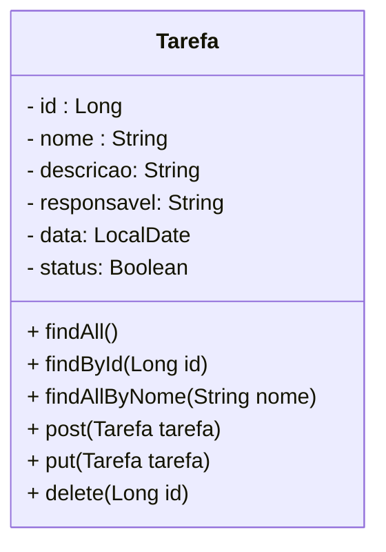

# Projeto Todo-List - TDD com Spring

 

     

  

## Diagrama de Classes

  

# Referências

 

<a href="https://docs.spring.io/spring-framework/docs/current/reference/html/testing.html#testing-introduction" target="_blank">Documentação Oficial do Spring Testing</a>

<a href="https://junit.org/junit5/" target="_blank">Página Oficial do JUnit5</a>

<a href="https://junit.org/junit5/docs/current/user-guide/" target="_blank">Documentação Oficial do JUnit 5</a>

<a href="https://www.h2database.com/html/main.html" target="_blank">Documentação Oficial do Banco de dados  H2</a>

<a href="https://gasparbarancelli.com/post/banco-de-dados-h2-com-spring-boot" target="_blank">Banco de dados H2 com Spring Boot</a>

